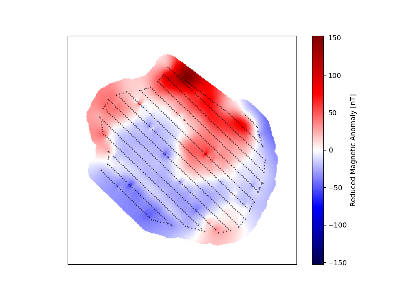

# MagDronePost
Post-Processing script for Airborne magnetic field measurements

## Description
This script is built to post-process files obtained through the [MagComPy software (Kaub et al., 2021)](https://github.com/leonkaub/MagComPy). It processes the point cloud into maps of the explored zone using [Fatiando A Terra](https://www.fatiando.org) codes.

Fisrt, the data is loaded and block-reduced using [VERDE](https://www.fatiando.org/verde/latest/).


Then, the obtained magnetic anomaly is interpolated using a Spline interpolator ([VERDE](https://www.fatiando.org/verde/latest/)).


Finally, the interpolated anomaly is reduced to the pole using [HARMONICA](https://www.fatiando.org/harmonica/latest/). The resulting map is saved into a GeoTiff file using [rasterio](https://rasterio.readthedocs.io/en/stable/).



## Installation
First, clone this repository on your computer.
Then, inside the new directory, run 
```
conda env create -f magneto.yml
conda activate magneto
```
The script can now run in the newly installed environment.

## Acknowledgement
We would like to thank severall awsome projects that are at the core of this toolbox. 

- [Fatiando A Terra](https://www.fatiando.org)
- [MagComPy](https://github.com/leonkaub/MagComPy)
- [Rasterio](https://rasterio.readthedocs.io/en/stable/)
- and many more . . .